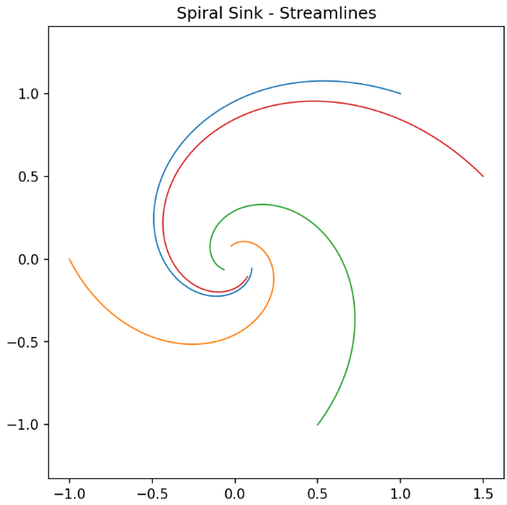
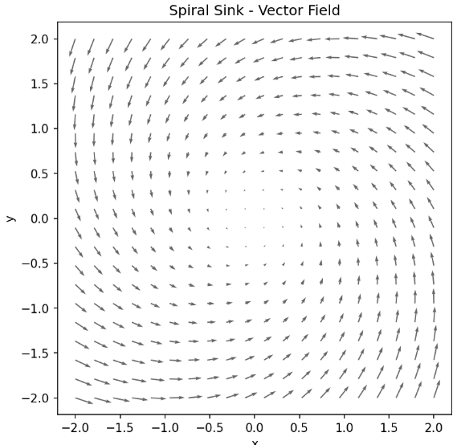
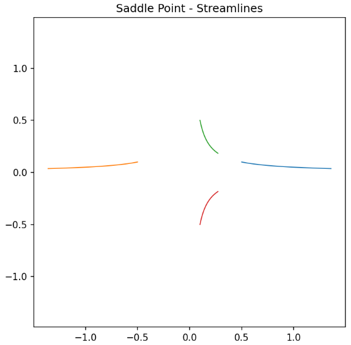
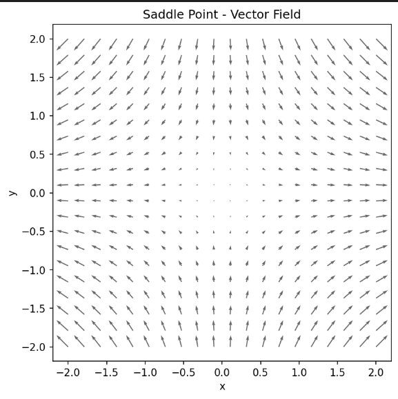

# fieldviz-mini

A tiny Python library for exploring **2D vector fields**, **attractors**, and **flow dynamics**.

### Features
- Simple API for defining vector fields  
- RK4 & Euler integrators  
- Streamline plotting  
- Quiver field visualization  
- A few preset fields (spiral sink, saddle, Lorenz-like)

### Install

```bash
pip install fieldviz-mini
```

### Example Output
```python
from fieldviz_mini import spiral_sink, plot_vector_field, plot_streamlines

field = spiral_sink()
plot_vector_field(field)
plot_streamlines(field, seeds=[(1,1), (-1,0), (0.5,-1)])
```
### Image Example Output

Here are a few sample visualizations produced by 'fieldviz-mini'

**Spiral Attractor**




---

This package is intentionally minimal : a small tool for intuition-building and exploration.